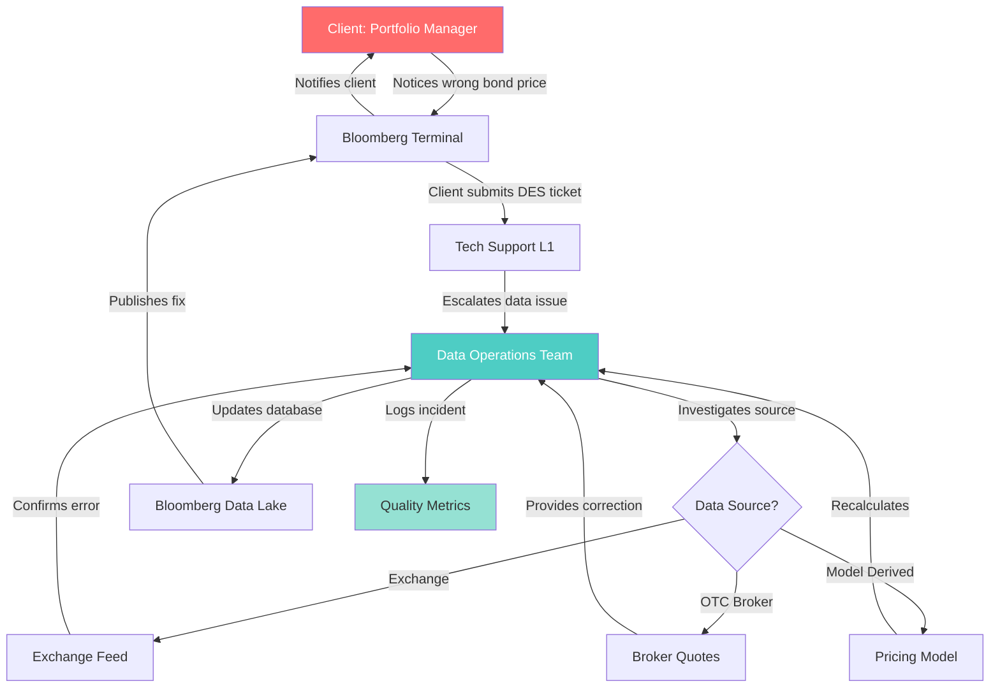

# Bloomberg Bond Price Data Issue Resolution Workflow

This repository outlines a detailed workflow diagram for resolving incorrect bond price data in a Bloomberg Terminal environment. The diagram expands on the initial process, incorporating additional support tiers and data sources to provide a comprehensive view of error handling and correction.

## Workflow Diagram

## Full Description

The diagram illustrates an enhanced workflow for identifying, investigating, and correcting discrepancies in bond pricing data within a financial data platform like Bloomberg. It emphasizes a tiered support system, multiple potential data sources, and the importance of logging for quality assurance. This process ensures timely resolution while maintaining data integrity and traceability.

### Key Components:
- **Client: Portfolio Manager**: The end-user who identifies the pricing error and initiates the resolution process.
- **Bloomberg Terminal**: The user interface for accessing and displaying financial data.
- **Tech Support L1**: First-level technical support that receives initial reports and escalates issues.
- **Data Operations Team**: The specialized team responsible for deep investigation, corrections, and updates.
- **Data Source?**: A decision point branching into different origins of the data (Exchange Feed, OTC Broker Quotes, or Model-Derived Pricing).
- **Exchange Feed**: Official pricing data from regulated exchanges.
- **Broker Quotes**: Over-the-counter (OTC) pricing provided by brokers.
- **Pricing Model**: Internal computational models used to derive prices.
- **Bloomberg Data Lake**: The centralized database for storing and managing financial data.
- **Quality Metrics**: A logging system for tracking incidents, performance, and improvements.

### Step-by-Step Process:
1. **Error Detection**: The Portfolio Manager notices an incorrect bond price on the Bloomberg Terminal and reports it.
2. **Initial Reporting**: The client submits a DES (Data Error System) ticket through the terminal, directed to first-level tech support.
3. **Escalation**: Tech Support L1 assesses the ticket and escalates data-related issues to the Data Operations Team for specialized handling.
4. **Investigation**: The Data Operations Team investigates the root cause by identifying the data source, which could be:
   - **Exchange Feed**: Contacts the exchange to confirm if their feed had an error.
   - **OTC Broker Quotes**: Reaches out to brokers for updated or corrected quotes.
   - **Pricing Model**: Recalculates prices using the internal model if it's the source of the discrepancy.
5. **Confirmation and Correction**: Based on the source:
   - The exchange confirms the feed error.
   - Brokers provide corrected quotes.
   - The model is recalculated to produce accurate prices.
6. **Database Update**: The Data Operations Team updates the Bloomberg Data Lake with the corrected data.
7. **Publication**: The corrected data is published back to the Bloomberg Terminal, making it available to the client.
8. **Notification**: The terminal notifies the client of the fix, completing the resolution loop.
9. **Logging**: Throughout the process, the Data Operations Team logs the incident in Quality Metrics for analysis, auditing, and future prevention of similar issues.

### Visual Highlights:
- **Red (Client)**: Highlights the client's critical role in initiating the workflow, with white text for contrast.
- **Teal (Data Operations Team)**: Emphasizes the core corrective team, with white text.
- **Light Green (Quality Metrics)**: Represents the monitoring and improvement aspect.

This workflow demonstrates a robust, multi-layered approach to data quality management in high-stakes financial environments, ensuring collaboration across teams and sources for efficient problem-solving.
