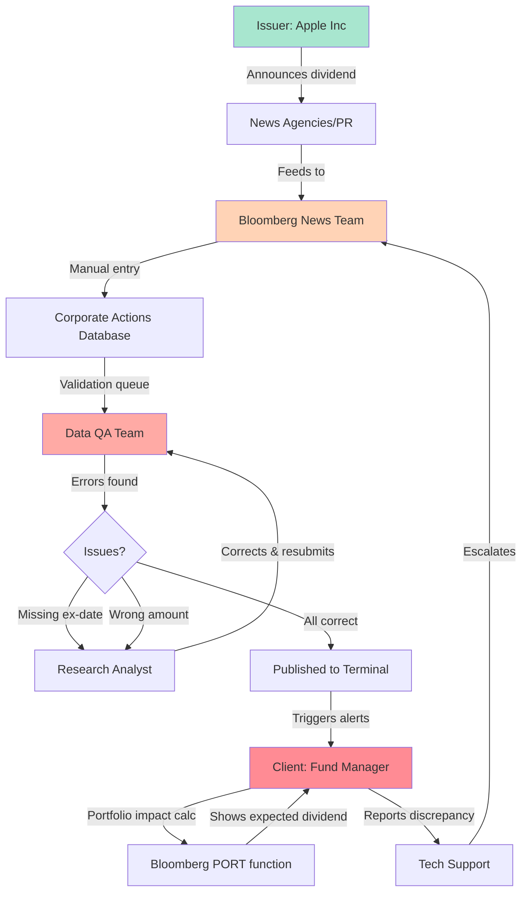

# Bloomberg Dividend Announcement Workflow

This repository describes a workflow diagram for handling corporate dividend announcements, such as those from issuers like Apple Inc., within the Bloomberg platform. The diagram outlines the end-to-end process from announcement to client notification, including data entry, validation, publication, and potential error handling.

## Workflow Diagram

## Full Description

The diagram illustrates the complex process of disseminating and validating corporate dividend information in a financial data ecosystem like Bloomberg. It emphasizes manual data handling, quality assurance, and the feedback loop for corrections to ensure accurate information reaches clients, who can then assess impacts on their portfolios.

### Key Components:
- **Issuer: Apple Inc.**: The company announcing the dividend, initiating the workflow.
- **News Agencies/PR**: External sources that relay the announcement.
- **Bloomberg News Team**: Internal team responsible for capturing and entering the data.
- **Corporate Actions Database**: The repository for storing corporate event data like dividends.
- **Data QA Team**: Quality assurance group that validates entered data for accuracy.
- **Issues?**: A decision point identifying potential problems (e.g., missing ex-dividend date or incorrect amount).
- **Research Analyst**: Specialist who investigates and corrects errors.
- **Published to Terminal**: The approved data is released to the Bloomberg Terminal for client access.
- **Client: Fund Manager**: The end-user who receives alerts and analyzes portfolio impacts.
- **Bloomberg PORT Function**: A tool for calculating expected dividends and portfolio adjustments.
- **Tech Support**: Support channel for client reports of discrepancies, escalating back to the News Team.

### Step-by-Step Process:
1. **Announcement**: The issuer (e.g., Apple Inc.) publicly announces a dividend.
2. **Relay via News**: News agencies or public relations channels feed the information to Bloomberg's News Team.
3. **Data Entry**: The Bloomberg News Team manually enters the dividend details into the Corporate Actions Database.
4. **Validation**: The data enters a queue for review by the Data QA Team to check for errors.
5. **Error Detection**: If issues are found (such as a missing ex-dividend date or wrong dividend amount), the process branches to a Research Analyst for correction.
6. **Correction Loop**: The Research Analyst investigates, corrects the data, and resubmits it to the QA Team for re-validation.
7. **Approval and Publication**: Once validated, the data is published to the Bloomberg Terminal, triggering alerts to subscribed clients.
8. **Client Notification**: The Fund Manager receives the alert and uses the Bloomberg PORT function to calculate the expected dividend and its impact on the portfolio.
9. **Verification**: The client sees the expected dividend details.
10. **Discrepancy Reporting**: If the client spots a discrepancy (e.g., between calculated and published data), they report it to Tech Support.
11. **Escalation**: Tech Support escalates the issue back to the Bloomberg News Team for review and potential re-entry.

### Visual Highlights:
- **Light Green (Issuer)**: Represents the originating entity.
- **Peach (News Team)**: Highlights the data entry role.
- **Light Pink (QA Team)**: Emphasizes the validation and error-checking phase.
- **Darker Pink (Client)**: Focuses on the end-user interaction and feedback.

This workflow underscores the challenges of manual data processing in financial systems, the importance of rigorous QA, and the need for client feedback loops to maintain data reliability. It can serve as a blueprint for improving automation or reducing human error in similar corporate action workflows.
