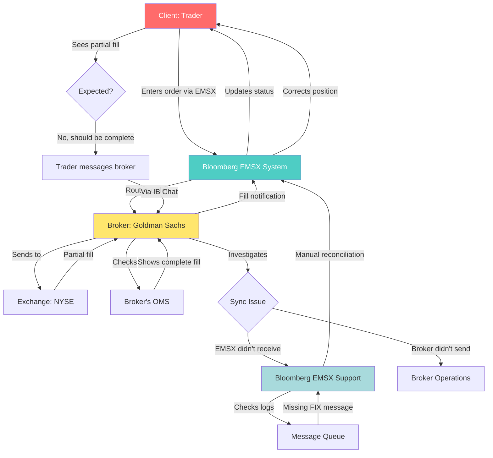

# Bloomberg EMSX Order Fill Synchronization Workflow

This repository details a workflow diagram for handling order execution and fill synchronization issues in Bloomberg's EMSX (Execution Management System) platform. The diagram illustrates the process from order entry through execution, partial fill detection, investigation, and resolution, highlighting potential synchronization problems between systems.

## Workflow Diagram

## Full Description

The diagram represents the end-to-end flow of a trade order in a Bloomberg EMSX environment, focusing on scenarios where partial fills occur and discrepancies arise between the trader's view, the EMSX system, and the broker's records. It underscores the complexities of real-time order execution, communication channels, and troubleshooting synchronization issues in high-frequency trading setups.

### Key Components:
- **Client: Trader**: The end-user initiating and monitoring the order.
- **Bloomberg EMSX System**: The platform for entering and routing orders.
- **Broker: Goldman Sachs**: The intermediary handling order execution.
- **Exchange: NYSE**: The marketplace where trades are executed.
- **Expected?**: A decision point where the trader assesses if the partial fill matches expectations.
- **Trader Messages Broker**: Direct communication via Instant Bloomberg (IB) Chat.
- **Broker's OMS**: The broker's Order Management System for internal tracking.
- **Sync Issue**: Branching point for identifying the source of the discrepancy.
- **Bloomberg EMSX Support**: Internal support for EMSX-related issues.
- **Broker Operations**: The broker's operational team.
- **Message Queue**: The system for logging and queuing FIX (Financial Information eXchange) protocol messages.
- **Manual Reconciliation**: Process to manually correct and synchronize data.

### Step-by-Step Process:
1. **Order Entry**: The trader enters an order through the Bloomberg EMSX System.
2. **Routing**: EMSX routes the order to the designated broker (e.g., Goldman Sachs).
3. **Execution**: The broker sends the order to the exchange (e.g., NYSE) for execution.
4. **Partial Fill Notification**: The exchange provides a partial fill, which the broker relays back through EMSX to the trader.
5. **Status Update**: The trader sees the updated order status showing a partial fill.
6. **Expectation Check**: If the partial fill is unexpected (e.g., the trader expected a complete fill), they initiate communication.
7. **Direct Messaging**: The trader messages the broker directly via IB Chat to inquire about the discrepancy.
8. **Broker Verification**: The broker checks their internal Order Management System (OMS), which shows a complete fill.
9. **Investigation**: The broker investigates the synchronization issue, determining if EMSX failed to receive the full fill or if the broker didn't send it.
10. **EMSX Support Involvement**: If EMSX didn't receive the message, Bloomberg EMSX Support checks the logs in the Message Queue.
11. **Issue Identification**: Logs reveal a missing FIX message, confirming the synchronization problem.
12. **Resolution**: EMSX Support performs manual reconciliation in the EMSX System to correct the position data.
13. **Correction Notification**: The trader receives the updated, corrected position in EMSX.

### Visual Highlights:
- **Red (Client)**: Emphasizes the trader's role with white text for visibility.
- **Teal (EMSX System)**: Highlights the core Bloomberg platform with white text.
- **Yellow (Broker)**: Represents the intermediary broker.
- **Light Blue (EMSX Support)**: Focuses on the resolution team.

This workflow highlights common challenges in trade execution, such as message drops in FIX protocols, and the need for manual interventions and inter-party communication to ensure accurate position reporting. It can inform improvements in automation and error detection in trading systems.
