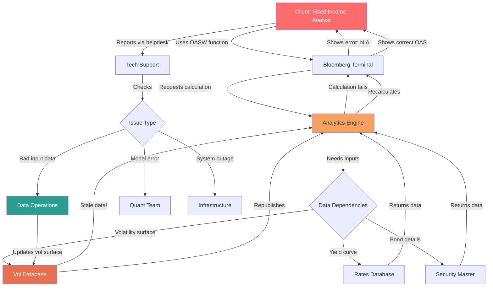

# Bloomberg OASW Calculation Workflow

This repository documents a workflow diagram for the Option-Adjusted Spread with Volatility (OASW) function in Bloomberg, focusing on data dependencies, calculation failures, and resolution processes. The diagram illustrates how stale or incorrect data can cause errors and the steps to troubleshoot and fix them.

## Workflow Diagram

## Full Description

The diagram outlines the process of performing an OASW (Option-Adjusted Spread with Volatility) calculation on Bloomberg, highlighting potential failures due to data quality issues and the subsequent troubleshooting workflow. It emphasizes the interconnectedness of data sources and the importance of timely updates in financial analytics.

### Key Components:
- **Client: Fixed Income Analyst**: The end-user requesting the calculation.
- **Bloomberg Terminal**: The interface for accessing functions and displaying results.
- **Analytics Engine**: The computational system handling the OASW calculation.
- **Data Dependencies**: A branching point for required inputs (bond details, yield curve, volatility surface).
- **Security Master**: Database for bond-specific information.
- **Rates Database**: Repository for yield curve data.
- **Vol Database**: Source for volatility surface data, highlighted as the source of the issue.
- **Tech Support**: Initial helpdesk for user reports.
- **Issue Type**: Classification of the problem (bad data, model error, or system outage).
- **Data Operations**: Team handling data updates and quality.
- **Quant Team**: Specialists for model-related issues.
- **Infrastructure**: Team for system-wide outages.

### Step-by-Step Process:
1. **Function Usage**: The Fixed Income Analyst initiates an OASW calculation using the Bloomberg Terminal.
2. **Calculation Request**: The terminal sends the request to the Analytics Engine for processing.
3. **Data Retrieval**: The engine checks data dependencies:
   - Retrieves bond details from the Security Master.
   - Retrieves yield curve data from the Rates Database.
   - Retrieves volatility surface data from the Vol Database.
4. **Data Issue**: The Vol Database provides stale data, causing the calculation to fail.
5. **Failure Notification**: The Analytics Engine fails, and the terminal displays an error ("N.A." for Not Available).
6. **User Report**: The analyst reports the issue via the helpdesk to Tech Support.
7. **Issue Assessment**: Tech Support investigates the issue type, determining if it's bad input data, a model error, or a system outage.
8. **Resolution Path**: For bad input data, the Data Operations team is involved.
9. **Data Update**: Data Operations updates the stale volatility surface in the Vol Database.
10. **Republishing**: The updated data is republished to the Analytics Engine.
11. **Recalculation**: The engine performs the calculation again successfully.
12. **Correct Result**: The terminal displays the correct Option-Adjusted Spread (OAS) to the analyst.

### Visual Highlights:
- **Red (Client)**: Emphasizes the user's role with white text.
- **Orange (Analytics Engine)**: Highlights the core computation component.
- **Red-Orange (Vol Database)**: Draws attention to the problematic data source with white text.
- **Teal (Data Operations)**: Represents the resolution team with white text.

This workflow demonstrates common challenges in real-time financial analytics, such as data freshness, and the need for robust support structures to ensure accurate calculations. It can guide improvements in data validation and automated error handling.
