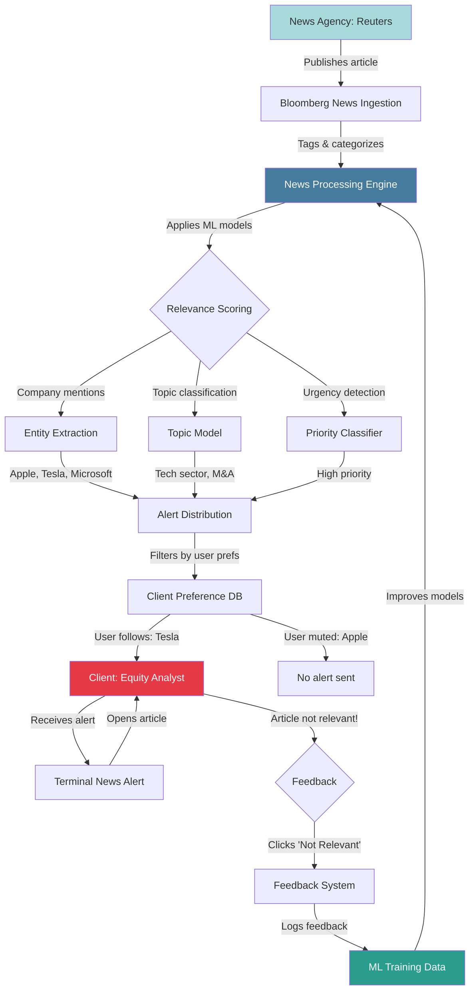

# Bloomberg News Alert Workflow

This repository outlines a workflow diagram for Bloomberg's news processing and alert distribution system. The diagram details the ingestion, analysis, personalization, and feedback loop for news articles, emphasizing machine learning applications in relevance scoring and user preferences.

## Workflow Diagram

## Full Description

The diagram illustrates the end-to-end process of handling news from external agencies like Reuters through Bloomberg's systems, including ingestion, machine learning-driven analysis, personalized alerting, and a feedback mechanism for continuous improvement. It highlights the role of AI in filtering and prioritizing information to deliver relevant news to users.

### Key Components:
- **News Agency: Reuters**: External source publishing articles.
- **Bloomberg News Ingestion**: System for receiving and initial processing of news feeds.
- **News Processing Engine**: Core component for tagging, categorization, and analysis.
- **Relevance Scoring**: Branching point for applying ML models to score article importance.
- **Entity Extraction**: Identifies mentioned entities (e.g., companies like Apple, Tesla, Microsoft).
- **Topic Model**: Classifies articles by topics (e.g., Tech sector, Mergers & Acquisitions).
- **Priority Classifier**: Detects urgency levels (e.g., high priority).
- **Alert Distribution**: Aggregates scores and prepares alerts for distribution.
- **Client Preference DB**: Database storing user settings for following or muting topics/entities.
- **Client: Equity Analyst**: End-user who receives and interacts with alerts.
- **No Alert Sent**: Outcome when preferences block an alert (e.g., muted Apple).
- **Terminal News Alert**: The alert displayed on the Bloomberg Terminal.
- **Feedback**: Decision point for user feedback on relevance.
- **Feedback System**: Captures user input.
- **ML Training Data**: Repository for logged feedback to train models.
- **News Processing Engine**: Loop back for model improvement.

### Step-by-Step Process:
1. **Publication**: A news agency like Reuters publishes an article.
2. **Ingestion**: Bloomberg's news ingestion system receives and processes the incoming feed.
3. **Processing**: The News Processing Engine tags and categorizes the article.
4. **ML Analysis**: Relevance scoring applies multiple ML models:
   - Entity extraction identifies company mentions.
   - Topic model classifies by sectors or events.
   - Priority classifier assesses urgency.
5. **Aggregation**: Results from all models feed into Alert Distribution for alert preparation.
6. **Personalization**: The system filters alerts based on user preferences in the Client Preference DB (e.g., follows Tesla, mutes Apple).
7. **Distribution**: Relevant alerts are sent; irrelevant ones are blocked.
8. **User Reception**: The Equity Analyst receives the alert on the Terminal.
9. **Interaction**: The analyst opens the article via the alert.
10. **Feedback Loop**: If the article is deemed not relevant, the analyst provides feedback (e.g., clicks "Not Relevant").
11. **Logging**: The Feedback System logs the input.
12. **Improvement**: Feedback is added to ML Training Data, which refines the models in the News Processing Engine.

### Visual Highlights:
- **Light Blue (News Agency)**: Represents the external source.
- **Dark Blue (News Processing Engine)**: Emphasizes the core engine with white text.
- **Red (Client)**: Highlights the end-user with white text.
- **Teal (ML Training Data)**: Focuses on the data for model training with white text.

This workflow showcases the integration of AI in news delivery, the importance of user personalization, and the value of feedback loops for enhancing machine learning accuracy in financial news systems.
