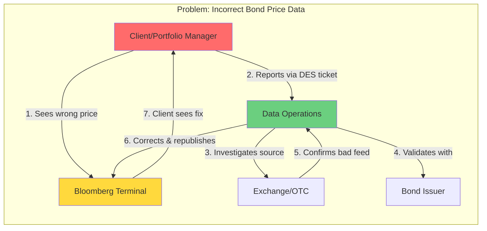

# Bloomberg Bond Price Data Issue Workflow

This repository documents a workflow diagram illustrating the process of identifying and resolving incorrect bond price data in a Bloomberg Terminal environment. The diagram highlights the roles and steps involved in maintaining data accuracy for financial instruments.

## Workflow Diagram

## Full Description

The diagram depicts a structured workflow for addressing discrepancies in bond pricing data, a critical issue in financial markets where accuracy is paramount. It involves multiple stakeholders including clients, data operations teams, issuers, and exchanges, ensuring that errors are detected, investigated, and corrected promptly to minimize financial risks.

### Key Components:
- **Client/Portfolio Manager**: Represents the end-user who interacts with the Bloomberg Terminal to view bond prices.
- **Bloomberg Terminal**: The primary interface for accessing real-time financial data.
- **Data Operations**: The internal team responsible for data management, validation, and correction.
- **Bond Issuer**: The entity that issued the bond, used for verification purposes.
- **Exchange/OTC**: The market source (exchange or over-the-counter) where the bond is traded.

### Step-by-Step Process:
1. **Detection of Error**: The client observes an incorrect price on the Bloomberg Terminal (e.g., a bond trading at an unrealistic value).
2. **Reporting**: The client submits a report via a DES (likely "Data Error System" or similar ticketing system) to alert the Data Operations team.
3. **Investigation**: The Data Operations team traces the data back to its source, contacting the relevant Exchange or OTC provider to analyze the feed.
4. **Validation**: To confirm the error, the team cross-verifies with the Bond Issuer for authoritative pricing information.
5. **Confirmation**: The Exchange acknowledges the issue, such as a corrupted or delayed data feed, leading to the incorrect display.
6. **Correction and Republishing**: Data Operations rectifies the data (e.g., updating feeds or applying manual overrides) and pushes the corrected information back to the Bloomberg Terminal.
7. **Resolution**: The client now sees the accurate price, restoring confidence in the data.

### Visual Highlights:
- **Red (Client)**: Emphasizes the user's role as the initiator of the process.
- **Yellow (Terminal)**: Highlights the technology platform central to the workflow.
- **Green (DataTeam)**: Represents the corrective action team, symbolizing resolution.

This workflow underscores the importance of robust data governance in finance, combining human oversight, cross-party collaboration, and technical corrections to uphold market integrity. It serves as a reference for similar data quality issues in Bloomberg-related projects.
